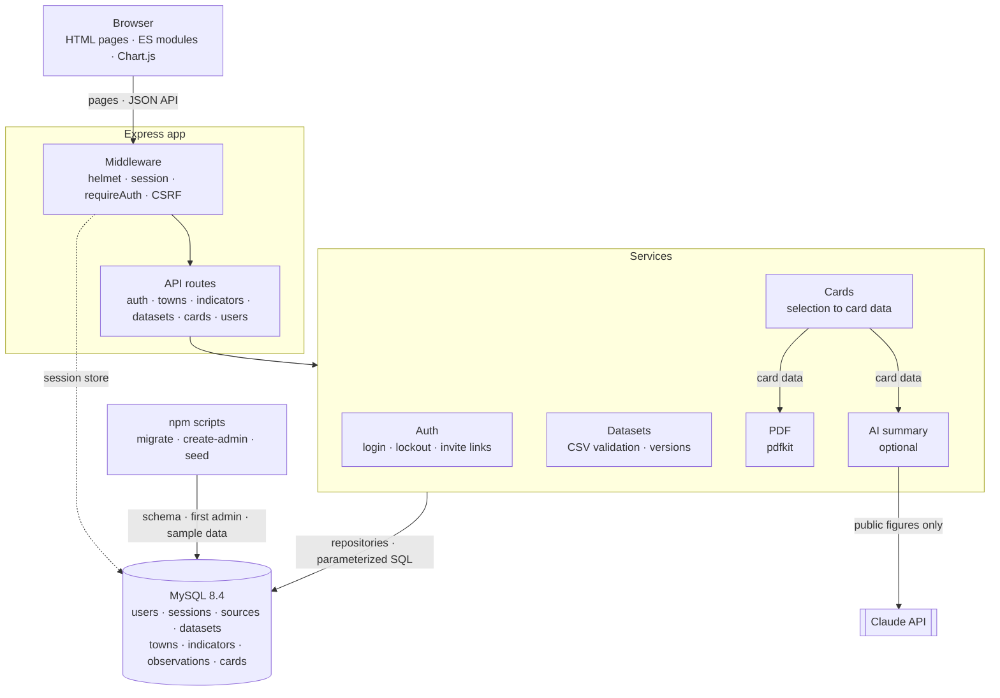

# System architecture

How the CT Civic Data Explorer fits together. Solid arrows are requests and data flow; the dotted arrow is the session store.

- Every card starts as a **selection** (towns, indicators, and a layout of text, chart and table blocks). The Cards service turns it into one card-data object, which the browser preview, the PDF and the AI summary all use, so they always match.
- Rates such as poverty rate are computed on the server from stored values.
- The AI summary is optional; cards build and export without it.
